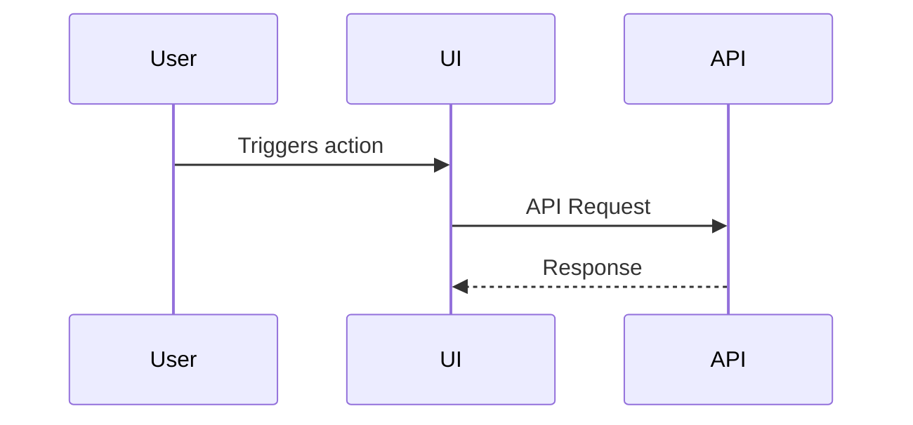

# git-ops — Expert Git Workflow Skill

## Overview

A multi-mode Git & GitHub skill triggered by **plain English commands**. It automatically detects
the user's intent and runs the correct sub-workflow — from a simple commit with a short description
to a full PR with security gating. All modes that commit share the same security-first gate.

---

## 🧠 Step 0 — Intent Detection (ALWAYS RUN FIRST)

Parse the user's raw request and map it to one of the following **modes**:

| User says (examples) | Mode |
|---|---|
| `"commit my staged changes"`, `"commit with message X"`, `"save my work"` | **[A] Commit Only** |
| `"push to main"`, `"push my branch"`, `"push to feature/x"` | **[B] Push Only** |
| `"commit and push"`, `"save and push"`, `"commit then push to X"` | **[C] Commit + Push** |
| `"create a PR"`, `"open a pull request"`, `"PR to main"` | **[D] Create PR** (implies commit + push first) |
| `"commit, push and PR"`, `"do it all"`, `"full workflow"` | **[E] Full Workflow** (commit + push + PR) |
| `"new branch X then PR"`, `"create branch feature/x and PR"` | **[F] Branch + Full Workflow** |

> 💡 If the user's intent is ambiguous, default to **[E] Full Workflow** and inform them.

Also extract from the request:
- **Commit message**: If the user provides one (e.g. `"commit with message 'fix auth bug'"`), validate it follows conventional commit format first (see Step 6). Otherwise auto-generate from the diff using the conventional format.
- **Branch name**: Any mention of a branch (e.g. `"push to feature/login"`, `"branch hotfix/123"`).
- **Base/destination branch**: For PRs (e.g. `"PR to main"`, `"merge into develop"`). Default = `main`.
- **PR description hint**: Any context hints for the PR body (e.g. `"PR about the new login flow"`).

> ⚠️ **All commit messages MUST follow the Conventional Commits format** (enforced by commitlint). See Step 6 for the full rules and type reference.

---

## 🌿 Step 1 — Branch Setup  *(Modes: D, E, F — and any mode where user named a branch)*

> **Skip for [A], [B], [C]** unless the user explicitly named a branch.

Determine the working branch:

**Case A — User specified a branch name:**
1. Check local:
   ```bash
   git branch --list <branch_name>
   ```
2. Check remote:
   ```bash
   git ls-remote --heads origin <branch_name>
   ```
3. Decision table:

   | Local exists? | Remote exists? | Action |
   |---|---|---|
   | ✅ Yes | — | `git checkout <branch_name>` |
   | ❌ No | ✅ Yes | `git checkout --track origin/<branch_name>` |
   | ❌ No | ❌ No | `git checkout -b <branch_name>` (new from current HEAD) |

4. Confirm: `"✅ Switched to branch '<branch_name>'"`
5. Set `<source_branch>` = `<branch_name>`.

**Case B — No branch specified:**
- Use current branch. Run `git rev-parse --abbrev-ref HEAD` to get `<source_branch>`.

> ⚠️ If a **new** branch is created and the user has staged/unstaged changes, those carry over automatically. Inform the user.

---

## 📋 Step 2 — Analyze Staged Changes  *(All modes except [B] Push Only)*

```bash
git status
git diff --staged --stat
git diff --staged
```

- If **nothing is staged** and mode requires a commit → tell the user:
  > "No staged changes found. Please run `git add <files>` first, then try again."  
  > And **stop**.
- Capture the full staged diff for use in Steps 3 and 4.

---

## 🔒 Step 3 — Vulnerability Scan  *(All modes except [B] Push Only)*

Scan the staged diff for:

| Check | What to look for |
|-------|-----------------|
| **Hardcoded secrets** | API keys, tokens, passwords, `AWS_`, `AZURE_`, `GCP_` credentials |
| **Dangerous functions** | `eval()`, `exec()`, `Function()`, `pickle.loads()`, `unserialize()` |
| **Suspicious packages** | Newly added deps in `package.json`, `requirements.txt`, `go.mod` — flag unknown or typosquatted names |
| **Injection risks** | SQL/command injection via string concatenation with user input |
| **Path traversal** | User-controlled input used in file paths |
| **Disabled security** | `verify=False`, `--insecure`, `checkCertificate=false` |
| **Insecure endpoints** | Hard-coded `http://` (non-HTTPS) endpoints |

---

## 🔍 Step 4 — Code Review  *(All modes except [B] Push Only)*

```bash
git diff --cached --unified=5 > .ai-review-diff.txt
```

Classify every finding:
- 🔴 **CRITICAL** — Hardcoded secrets, XSS, SQL injection, auth bypass, data loss risk
- 🟡 **MAJOR** — Logic bugs, unhandled errors, security anti-patterns
- 🟢 **MINOR** — Dead code, unused imports, naming issues
- 💡 **SUGGESTIONS** — Refactoring ideas

```bash
rm -f .ai-review-diff.txt
```

---

## 🚦 Step 5 — Gate Check (MANDATORY for all modes that commit)

After Steps 3 and 4, evaluate findings:

**If any 🔴 CRITICAL or 🟡 MAJOR issues found:**

```
⚠️  Issues Found — Review Before Committing
════════════════════════════════════════════

🔴 CRITICAL (<N> issues)
────────────────────────
  ● <file>:<line>
    <What the issue is>
    💊 Fix: <Exact fix>

🟡 MAJOR (<N> issues)
────────────────────────
  ● <file>:<line>
    <What the issue is>
    💊 Fix: <Exact fix>

📊 Summary: <N> critical, <N> major found.
```

Ask the user:
> "Critical or major issues were found. Do you want to **continue anyway** or **stop** to fix them first?"

- **Stop** → Halt. Remind them of the issues and suggest fixes.
- **Continue** → Proceed and note known issues in commit message / PR description.

**If only 🟢 MINOR / 💡 SUGGESTIONS, or no issues:**
- Briefly list any minor findings.
- Auto-proceed.

---

## 💾 Step 6 — Commit  *(Modes: A, C, D, E, F)*

### 6a — Conventional Commit Format (commitlint enforced)

All commit messages **must** follow the Conventional Commits spec — the project uses `@commitlint/config-conventional` via Husky's `commit-msg` hook, so any non-conforming message will be **rejected** by the hook.

**Format:**
```
<type>: <subject>

[optional body]
```

**Rules:**
- `type` and `subject` are **required** — committing without them will fail commitlint.
- `type` must be **lowercase**, from the table below.
- **No scope** — never add `(scope)` to the commit header.
- `subject` uses **imperative mood**, no capital first letter, no trailing period, ≤72 chars total for the header line.
- Body is optional — use it for bullet-point details when the diff is complex.

**Allowed types:**

| Type       | When to use                              |
| ---------- | ---------------------------------------- |
| `feat`     | New feature                              |
| `fix`      | Bug fix                                  |
| `docs`     | Documentation only                       |
| `style`    | Formatting, no logic change              |
| `refactor` | Code restructure, no feature/bug change  |
| `chore`    | Maintenance (deps, config, tooling)      |
| `test`     | Adding or updating tests                 |
| `perf`     | Performance improvements                 |
| `ci`       | CI/CD changes                            |
| `revert`   | Revert a previous commit                 |

**Valid examples:**
```bash
git commit -m "feat: add JWT refresh token"
git commit -m "fix: resolve cart quantity update bug"
git commit -m "chore: upgrade next.js to v16"
git commit -m "refactor: extract pagination helper"
```

**Invalid examples (will be rejected by commitlint):**
```bash
git commit -m "updated stuff"       # ❌ no type
git commit -m "Fix Bug"             # ❌ no type, capital letter
git commit -m "feat: "              # ❌ empty subject
```

### 6b — Build the commit message

**If user provided a commit message:**
- Check it against the conventional format above.
- If it's already valid → use it as-is and optionally append a bullet-point body.
- If it's **not** valid → auto-rewrite it into the correct format, inform the user what was changed, and explain why.

**If user did NOT provide a commit message:**
- Infer the best `type` from the staged diff:
  - New files / new functions → `feat`
  - Fix a broken behaviour → `fix`
  - Only comments/docs → `docs`
  - Only whitespace/formatting → `style`
  - Restructure without changing behaviour → `refactor`
  - Config/tooling/dependency updates → `chore`
  - Test files only → `test`
- **Do not add a scope** — subject should describe what changed concisely.
- Auto-generate the subject in imperative mood, ≤72 chars total for the header.
- Add a bullet-point body when the diff touches multiple files or has non-obvious changes.

### 6c — Run commit

```bash
git commit -m "<type>: <subject>" -m "<optional bullet-point body>"
```

Confirm: `"✅ Committed: '<type>: <subject>'"`

> ⚠️ If the commit is rejected by husky/commitlint, read the error, fix the message format, and retry automatically — **do not ask the user to fix it manually**.

---

## 🚀 Step 7 — Push  *(Modes: B, C, D, E, F)*

```bash
git push -u origin <source_branch>
```

Confirm: `"✅ Pushed to origin/<source_branch>"`

> For **[B] Push Only** — run this step, report the result, and **stop** (skip Steps 8–10).
> For **[C] Commit + Push** — run this step, report the result, and **stop** (skip Steps 8–10).
> For **[A] Commit Only** — skip this step entirely.

---

## 📝 Step 8 — Prepare PR Content  *(Modes: D, E, F)*

```bash
git log <destination_branch>..<source_branch> --oneline
git diff <destination_branch>..<source_branch> --stat
```

Generate a PR **title** and **body** following this template:

```markdown
## 📝 Brief Summary
<A short 2-3 sentence overview of the entire PR's purpose and impact.>

## 🚶‍♂️ Walkthrough
<A narrative explanation of how the feature works or the logical flow of the changed code.>

## 📋 Changes
| File | Summary of Changes |
|------|---|
| `path/to/file1.js` | <Brief description> |
| `path/to/file2.js` | <Brief description> |

## 🔄 Sequence Diagram


## ✅ Testing
<Brief note on how to test / verify the changes.>

*(If user chose to proceed despite security/quality issues, append a **⚠️ Known Issues** section)*
```

Write body to temp file:
```bash
# write PR body to .pr_body.md
```

---

## 🔗 Step 9 — Create the Pull Request  *(Modes: D, E, F)*

```bash
gh pr create \
  --base <destination_branch> \
  --head <source_branch> \
  --title "<Generated Title>" \
  --body-file .pr_body.md

rm -f .pr_body.md
```

---

## 📊 Step 10 — Fetch PR Status  *(Modes: D, E, F)*

```bash
sleep 3
gh pr view <source_branch> --json title,url,state,mergeable,headRefName,baseRefName,additions,deletions,changedFiles
```

---

## 📣 Step 11 — Final Report

### For Commit Only (Mode A):
```
✅ Committed Successfully!
══════════════════════════════════
🧾 Message:  <commit summary>
📁 Branch:   <source_branch>
🔒 Security: <✅ Clean | ⚠️ Issues noted>
```

### For Push Only (Mode B):
```
✅ Pushed Successfully!
══════════════════════════════════
📁 Branch:   <source_branch>  →  origin/<source_branch>
```

### For Commit + Push (Mode C):
```
✅ Committed & Pushed!
══════════════════════════════════
🧾 Commit:   <commit summary>
📁 Branch:   <source_branch>  →  origin/<source_branch>
🔒 Security: <✅ Clean | ⚠️ Issues noted>
```

### For PR Modes (D, E, F):
```
✅ Pull Request Created Successfully!
══════════════════════════════════════

📌 Title:   <PR Title>
🔗 URL:     <PR URL>
📊 Status:  <Open / Draft>
🔀 Merge:   <Mergeable / Has Conflicts / Unknown>
📁 Branch:  <source_branch> → <destination_branch>
📝 Changes: +<additions> / -<deletions> across <N> files

🧾 Commit:  <commit summary>
🔒 Security: <✅ Clean | ⚠️ Issues noted in PR description>
```

---

## 📖 Natural Language Trigger Examples

| User says | Detected mode |
|---|---|
| `"commit my changes"` | A — Commit Only |
| `"commit with message 'fix auth bug'"` | A — Commit Only (user message) |
| `"save my work with a short message"` | A — Commit Only (auto-generate) |
| `"push to main"` | B — Push Only |
| `"push my feature branch"` | B — Push Only |
| `"commit and push"` | C — Commit + Push |
| `"commit my staged files and push to origin"` | C — Commit + Push |
| `"save and sync my code"` | C — Commit + Push |
| `"create a PR to main"` | E — Full Workflow |
| `"open a pull request for my changes"` | E — Full Workflow |
| `"make a PR from feature/login to develop"` | F — Branch + Full Workflow |
| `"commit, push and open a PR"` | E — Full Workflow |
| `"do it all – commit push and PR to staging"` | E — Full Workflow |
| `"new branch feature/dashboard then PR"` | F — Branch + Full Workflow |

---

## ⚙️ Mode Execution Matrix

| Step | A: Commit | B: Push | C: Commit+Push | D/E: PR | F: Branch+PR |
|---|:---:|:---:|:---:|:---:|:---:|
| 0 — Intent Detection | ✅ | ✅ | ✅ | ✅ | ✅ |
| 1 — Branch Setup | ⬜ | ⬜ | ⬜ | ✅ | ✅ |
| 2 — Analyze Staged | ✅ | ⬜ | ✅ | ✅ | ✅ |
| 3 — Vuln Scan | ✅ | ⬜ | ✅ | ✅ | ✅ |
| 4 — Code Review | ✅ | ⬜ | ✅ | ✅ | ✅ |
| 5 — Gate Check | ✅ | ⬜ | ✅ | ✅ | ✅ |
| 6 — Commit | ✅ | ⬜ | ✅ | ✅ | ✅ |
| 7 — Push | ⬜ | ✅ | ✅ | ✅ | ✅ |
| 8 — PR Content | ⬜ | ⬜ | ⬜ | ✅ | ✅ |
| 9 — Create PR | ⬜ | ⬜ | ⬜ | ✅ | ✅ |
| 10 — PR Status | ⬜ | ⬜ | ⬜ | ✅ | ✅ |
| 11 — Report | ✅ | ✅ | ✅ | ✅ | ✅ |
